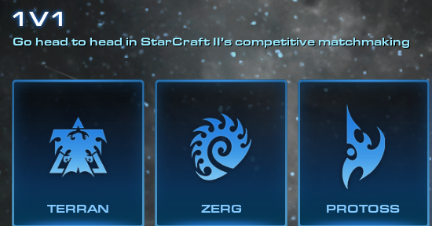

# How to play Starcraft 2
Starcraft 2 is a RTS(real-time strategy) game developed by Blizzard Entertainment. The game has 3 different races being the Protoss, Terran, and Zerg. Each race has a unique playstyle. To win a match, you need to build up your army, defend your own base and destroy your opponent's buildings.
## Preparation
Install Battle.net on your computer  
Install Starcraft 2 through Battle.net
## Steps
1. Open Starcraft 2
2. Pick a race that looks cool to you
> 
4. Start a game
5. Build workers (workers harvest resource for you to build up ur army)
> 
7. Build buildings (buildings can let you build your army, upgrades, and unlock higer tier army)
8. Build up your army and destroy your opponent!
> 
